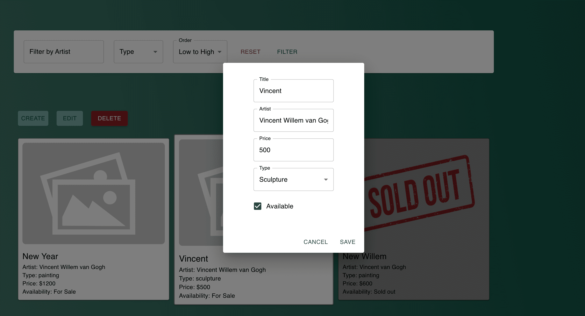

# Art-Gallery-Management
NestJS, PostgreSQL, Sequelize, React, TypeScript, Jest, Docker

## Contents
* [Main Information](#📜-Main-Information)
* [Stack](#Stack)
* [Installation and Usage](#Installation-and-Usage)
* [Examples](#Examples)

____

## 📜 Main Information

This web application enables gallery administrators to manage and display art pieces in a virtual gallery.
Users can view, filter, and sort through artwork, while gallery admins have control over listings, with 
the ability to add new artwork or remove existing pieces.

____

## Stack

### Client

React: 

✅ MaterialUI

✅ TypeScript

✅ React

Angular:

✅ Material Angular

✅ TypeScript

✅ Angular

✅ Rxjs

Server: 

✅ NestJS

✅ PostgreSQL

✅ Sequelize

✅ Jest

✅ Docker

____

## Installation and Usage

#### You can run this application either using npm commands or with Docker.

The project consists of the two parts (server and client).

You can use either the React client or the Angular client. 
They have the same functionality but different styles.

**Installation:**
* Clone the repository: git clone https://github.com/reyand8/Art-Gallery-Management.git
* Create .env file in the server directory

**Using Docker**

* Select react-client or angular-client in the docker-compose file  
* Build and start the containers using Docker Compose: docker-compose up

**Using npm:**

* Client
  * React
      - Navigate to the project directory: cd client-react
      - Install dependencies: npm install
          - Run the project: npm run start
          - Open a browser and navigate to: http://localhost:3000
  * Angular
      - Navigate to the project directory: cd client-angular
      - Install dependencies: npm install
          - Run the project: npm run start
          - Open a browser and navigate to: http://localhost:4200
  
* Server
    - Navigate to the server directory: cd server
    - Install dependencies: npm install
        - Run the project: npm run start:dev
        - Open a browser and navigate to: http://localhost:8080

____

## Examples

____
____

### Main

____
____

### Edit

____
____

### Create

